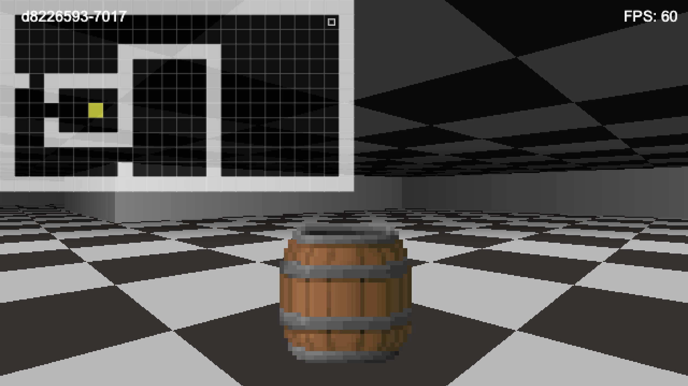

# Raycasting engine

A simple raycasting engine built with JavaScript and WebSockets, software rendered, no GPU acceleration. This project is
inspired by classic games like Wolfenstein 3D and Doom.



## Installation

1. Install packages
   ```sh
   npm install
   ```
2. Start Websocket server
   ```sh
   npm run ws
   ```
3. Start frontend
   ```sh
   npm run frontend
   ```
4. Open your browser and navigate to `http://localhost:3000`

## Acknowledgments

Useful resources and tools that helped in the development of this project:

* [Tsoding](https://www.youtube.com/watch?v=K1xEkA46CuM)
* [Lode's Computer Graphics Tutorial](https://lodev.org/cgtutor/raycasting.html)
* [Canvas API](https://developer.mozilla.org/en-US/docs/Web/API/Canvas_API)
* [WebSockets](https://developer.mozilla.org/en-US/docs/Web/API/WebSockets_API)
* [OffscreenCanvas](https://developer.mozilla.org/en-US/docs/Web/API/OffscreenCanvas)
